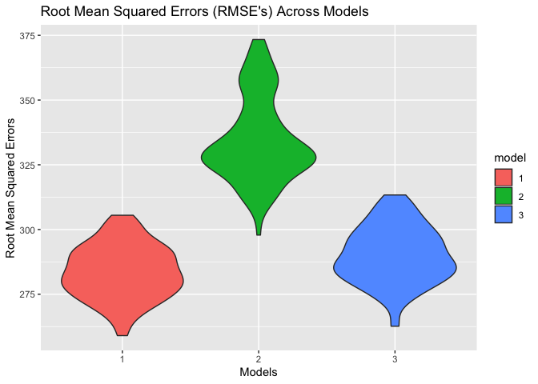

HW6
================
Amanda Howarth
11/23/2019

``` r
library(rvest)
```

    ## Loading required package: xml2

``` r
library(tidyverse)
```

    ## ── Attaching packages ──────────────────────────────────────────────────────── tidyverse 1.2.1 ──

    ## ✔ ggplot2 3.2.1     ✔ purrr   0.3.2
    ## ✔ tibble  2.1.3     ✔ dplyr   0.8.3
    ## ✔ tidyr   1.0.0     ✔ stringr 1.4.0
    ## ✔ readr   1.3.1     ✔ forcats 0.4.0

    ## ── Conflicts ─────────────────────────────────────────────────────────── tidyverse_conflicts() ──
    ## ✖ dplyr::filter()         masks stats::filter()
    ## ✖ readr::guess_encoding() masks rvest::guess_encoding()
    ## ✖ dplyr::lag()            masks stats::lag()
    ## ✖ purrr::pluck()          masks rvest::pluck()

``` r
library(purrr)
library(broom)
library(modelr)
```

    ## 
    ## Attaching package: 'modelr'

    ## The following object is masked from 'package:broom':
    ## 
    ##     bootstrap

``` r
library(mgcv)
```

    ## Loading required package: nlme

    ## 
    ## Attaching package: 'nlme'

    ## The following object is masked from 'package:dplyr':
    ## 
    ##     collapse

    ## This is mgcv 1.8-28. For overview type 'help("mgcv-package")'.

``` r
library(patchwork)
```

## Importing data

``` r
birthweight = read_csv("./data/birthweight.csv")
```

    ## Parsed with column specification:
    ## cols(
    ##   .default = col_double()
    ## )

    ## See spec(...) for full column specifications.

``` r
birthweight_clean = birthweight %>% 
  janitor::clean_names() %>% 
  mutate(babysex = factor(babysex, levels = c("1", "2")),
         frace = factor(frace, levels = c("1", "2", "3", "4", "8", "9")),
         mrace = factor(mrace, levels = c("1", "2", "3", "4", "8", "9")),
         malform = factor(malform, levels = c("0", "1")),
         babysex = recode(babysex, "1" = "male", "2" = "female"), 
         frace = recode(frace, "1" = "white", "2" = "black", "3" = "asian", "4" = "puerto rican", "8" = "other", "9" = "unknown"),
         mrace = recode(mrace, "1" = "white", "2" = "black", "3" = "asian", "4" = "puerto rican", "8" = "other", "9" = "unknown"), 
         malform = recode(malform, "0" = "absent", "1" = "present")) %>%
  rename(bwt_grams = bwt, mom_weight_lbs = delwt, family_income = fincome, father_race = frace, mom_race = mrace, ges_age_weeks = gaweeks, age_menarche = menarche, mom_height = mheight, mom_age = momage, mom_pre_bmi = ppbmi)
```

## Model building

I have hypothesized that a baby’s physical and biological
characteristics as well as the mother’s physical and biological
characteristics at the time of delivery would affect the baby’s weight
at birth. Thus, in building my model I analyzed baby’s sex, head
circumference, baby length, gestational age, and presence of
malformations that would affect weight. Additionally, I analyzed
mother’s weight, age at delivery, and height.

  - say that u removed some bc it did not increase in the R^2
  - say looked at all of them first and then chose significant ones
  - say teh R^2 value
  - reisduals ? predictions?
  - removed malform bc not
significant

<!-- end list -->

``` r
fit_bwt_model = lm(bwt_grams ~ babysex + bhead + blength + mom_weight_lbs + ges_age_weeks, data = birthweight_clean)

fit_bwt_model %>% 
  broom::tidy() %>% 
  knitr::kable()
```

| term             |      estimate |  std.error |   statistic |   p.value |
| :--------------- | ------------: | ---------: | ----------: | --------: |
| (Intercept)      | \-6314.473992 | 96.8895248 | \-65.171896 | 0.0000000 |
| babysexfemale    |     31.816841 |  8.7382164 |    3.641114 | 0.0002746 |
| bhead            |    137.752405 |  3.5374025 |   38.941683 | 0.0000000 |
| blength          |     79.268025 |  2.0712816 |   38.270037 | 0.0000000 |
| mom\_weight\_lbs |      2.027167 |  0.1992253 |   10.175245 | 0.0000000 |
| ges\_age\_weeks  |     13.675844 |  1.4959676 |    9.141805 | 0.0000000 |

``` r
fit_bwt_model %>%
  broom::glance() %>% 
  knitr::kable()
```

| r.squared | adj.r.squared |    sigma | statistic | p.value | df |     logLik |      AIC |      BIC |  deviance | df.residual |
| --------: | ------------: | -------: | --------: | ------: | -: | ---------: | -------: | -------: | --------: | ----------: |
| 0.6963589 |     0.6960087 | 282.3782 |  1988.803 |       0 |  6 | \-30661.01 | 61336.02 | 61380.65 | 345741660 |        4336 |

Show a plot of model residuals against fitted values – use
add\_predictions and add\_residuals in making this plot.

``` r
birthweight_clean %>% 
  modelr::add_residuals(fit_bwt_model) %>% 
  modelr::add_predictions(fit_bwt_model) %>% 
  ggplot(aes(x = pred, y = resid)) + geom_point() + labs(
    y = "Residuals", 
    x = "Predicted values of Birthweight", 
    title = "Residuals Plotted Against Birthweight"
    
  )
```

<!-- -->

## Model using using length at birth and gestational age as predictors (main effects only)

``` r
sample_model_1 = lm(bwt_grams ~  blength + ges_age_weeks, data = birthweight_clean)

sample_model_1 %>% 
  broom::tidy() %>% 
  knitr::kable()
```

| term            |     estimate | std.error |  statistic | p.value |
| :-------------- | -----------: | --------: | ---------: | ------: |
| (Intercept)     | \-4347.66707 | 97.958360 | \-44.38281 |       0 |
| blength         |    128.55569 |  1.989891 |   64.60439 |       0 |
| ges\_age\_weeks |     27.04673 |  1.717930 |   15.74379 |       0 |

``` r
sample_model_1 %>% 
  broom::glance() %>% 
  knitr::kable()
```

| r.squared | adj.r.squared |    sigma | statistic | p.value | df |     logLik |      AIC |      BIC |  deviance | df.residual |
| --------: | ------------: | -------: | --------: | ------: | -: | ---------: | -------: | -------: | --------: | ----------: |
| 0.5768894 |     0.5766943 | 333.2174 |  2958.001 |       0 |  3 | \-31381.32 | 62770.64 | 62796.14 | 481775846 |        4339 |

## Model using head circumference, length, sex, and all interactions (including the three-way interaction) between these

``` r
sample_model_2 = lm(bwt_grams ~ bhead + blength + babysex + bhead*blength + bhead*babysex + babysex*blength + bhead*blength*babysex, data = birthweight_clean)

sample_model_2 %>% 
  broom::tidy() %>% 
  knitr::kable()
```

| term                        |       estimate |    std.error |   statistic |   p.value |
| :-------------------------- | -------------: | -----------: | ----------: | --------: |
| (Intercept)                 | \-7176.8170221 | 1264.8397394 | \-5.6740920 | 0.0000000 |
| bhead                       |    181.7956350 |   38.0542051 |   4.7772811 | 0.0000018 |
| blength                     |    102.1269235 |   26.2118095 |   3.8962180 | 0.0000992 |
| babysexfemale               |   6374.8683508 | 1677.7669213 |   3.7996150 | 0.0001469 |
| bhead:blength               |    \-0.5536096 |    0.7802092 | \-0.7095656 | 0.4780117 |
| bhead:babysexfemale         |  \-198.3931810 |   51.0916850 | \-3.8830816 | 0.0001047 |
| blength:babysexfemale       |  \-123.7728875 |   35.1185360 | \-3.5244319 | 0.0004288 |
| bhead:blength:babysexfemale |      3.8780531 |    1.0566296 |   3.6702106 | 0.0002453 |

``` r
sample_model_2 %>% 
  broom::glance() %>% 
  knitr::kable()
```

| r.squared | adj.r.squared |    sigma | statistic | p.value | df |    logLik |      AIC |      BIC |  deviance | df.residual |
| --------: | ------------: | -------: | --------: | ------: | -: | --------: | -------: | -------: | --------: | ----------: |
|  0.684876 |      0.684367 | 287.7344 |  1345.616 |       0 |  8 | \-30741.6 | 61501.19 | 61558.58 | 358816655 |        4334 |

## Cross Validation

``` r
cv_df = 
  crossv_mc(birthweight_clean, 100) %>% 
  mutate(train = map(train, as_tibble),
         test = map(test, as_tibble)
         ) %>% 
  mutate(fit_bwt_model = map(train, ~lm(bwt_grams ~ babysex + bhead + blength + mom_weight_lbs + ges_age_weeks, data = .x)), 
         sample_model_1= map(train, ~lm(bwt_grams ~ blength + ges_age_weeks, data = .x)),
         sample_model_2= map(train, ~lm(bwt_grams ~ bhead + blength + babysex + bhead*blength + bhead*babysex + babysex*blength + bhead*blength*babysex, data = .x))) %>%
  mutate(rmse_1 = map2_dbl(fit_bwt_model, test, ~rmse(model = .x, data = .y)),
         rmse_2 = map2_dbl(sample_model_1, test, ~rmse(model = .x, data = .y)),
         rmse_3 = map2_dbl(sample_model_2, test, ~rmse(model = .x, data = .y)))

cv_df %>% 
  select(starts_with("rmse")) %>% 
  pivot_longer(
    everything(),
    names_to = "model", 
    values_to = "rmse",
    names_prefix = "rmse_") %>% 
  mutate(model = fct_inorder(model)) %>% 
  ggplot(aes(x = model, y = rmse, fill = model)) + geom_violin() + labs(
    y = "Root Mean Squared Errors", 
    x = "Models", 
    title = "Root Mean Squared Errors (RMSE's) Across Models"
  )
```

<!-- -->

## Problem 2

``` r
weather_df = 
  rnoaa::meteo_pull_monitors(
    c("USW00094728"),
    var = c("PRCP", "TMIN", "TMAX"), 
    date_min = "2017-01-01",
    date_max = "2017-12-31") %>%
  mutate(
    name = recode(id, USW00094728 = "CentralPark_NY"),
    tmin = tmin / 10,
    tmax = tmax / 10) %>%
  select(name, id, everything())
```

    ## Registered S3 method overwritten by 'crul':
    ##   method                 from
    ##   as.character.form_file httr

    ## Registered S3 method overwritten by 'hoardr':
    ##   method           from
    ##   print.cache_info httr

    ## file path:          /Users/amandahowarth/Library/Caches/rnoaa/ghcnd/USW00094728.dly

    ## file last updated:  2019-10-22 21:16:05

    ## file min/max dates: 1869-01-01 / 2019-10-31
